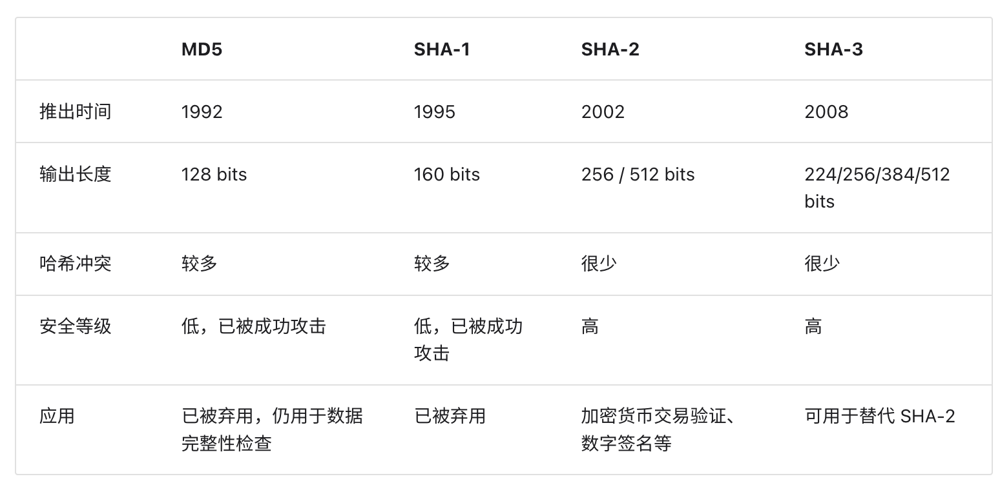

## 哈希表
### 哈希冲突
- 负载因子 = 哈希表元素个数 / 桶数量
  - 反映哈希冲突的严重程度
  - 在 Java 中当 负载因子 > 0.75 时会将哈希表扩容至原来的 2 倍
  - 为了避免哈希冲突，大多编程语言会在哈希表初始化时将其设置得足够大来减少频繁扩容（耗时）

- 哈希表的改良（哈希冲突的解决）
  - 链式地址（每一个哈希表中存放一个链表，链表内是所有冲突的元素）
  
  > 可将链表转为「AVL树」或「红黑树」来降低查询的时间复杂度至O(logN)
  - 开放寻址：不引入额外的数据结构，而通过「多次探测」来处理冲突
    - 线性探测：如遇冲突按固定步长向后插入
    - 多次哈希：按顺序采用多个哈希函数计算地址
  > 开放寻址都不能直接删除元素，需要借助额外的标记位来标记删除和未插入。

### 哈希算法
#### 目标
- 确定性：对于相同的输入，哈希算法应始终产生相同的输出。这样才能确保哈希表是可靠的。
- 效率高：计算哈希值的过程应该足够快，计算开销尽量小
- 均匀分布：哈希算法应使得键值对平均分布在哈希表中，降低冲突概率（【TIPS】为了保证哈希值的均匀分布，常用其与大质数取模。）

#### 设计
简单的哈希算法可通过以下方式实现，但都比较简易不够安全：
- 加法哈希
- 乘法哈希
- 异或哈希
- 旋转哈希
> 例如，加法和异或都有交换律，所以不能区分内容相同但顺序不同的两个 key，还是会造成冲突。

#### 常见的成熟哈希算法
 